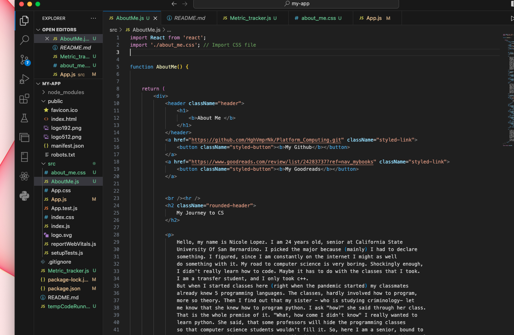
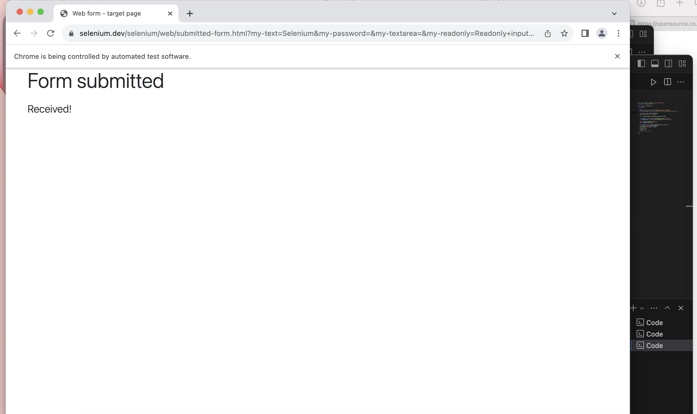
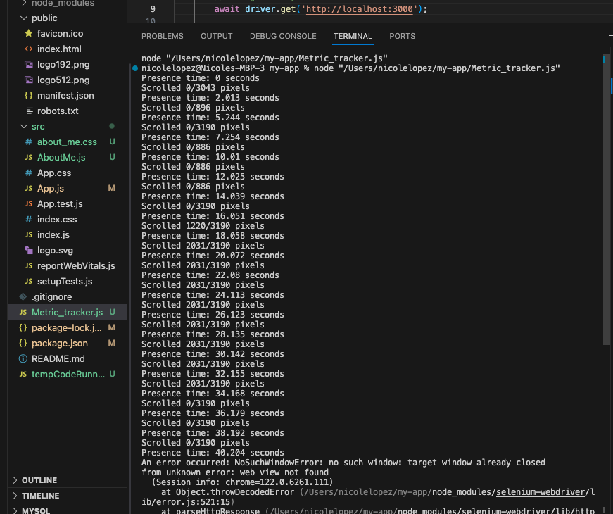

# Metric Tracker

PROVIDE OVERVIEW OF ASSIGNMENT HERE

Time spent: **10** hours spent in total

## Features

The following **required** features are completed:

- [x] Organize Github project for Assignment 2 (2 pt)
- [x] Transfer your About Me Page into a React App with screenshot of output in the Images folder(3 pt)
- [x] Set up Selenium (2 pt)
- [x] Write your first Selenium script with screenshot of output in the Images folder (4 pt)
- [x] Monitor at least 2 metrics using Selenium with screenshot of output in the Images folder (4 pt)

## Screenshot and/or Video Walkthrough

