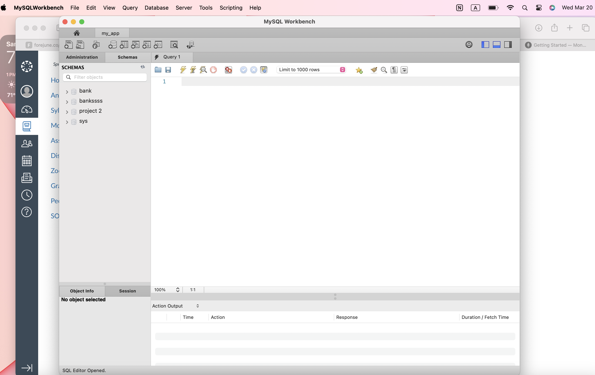
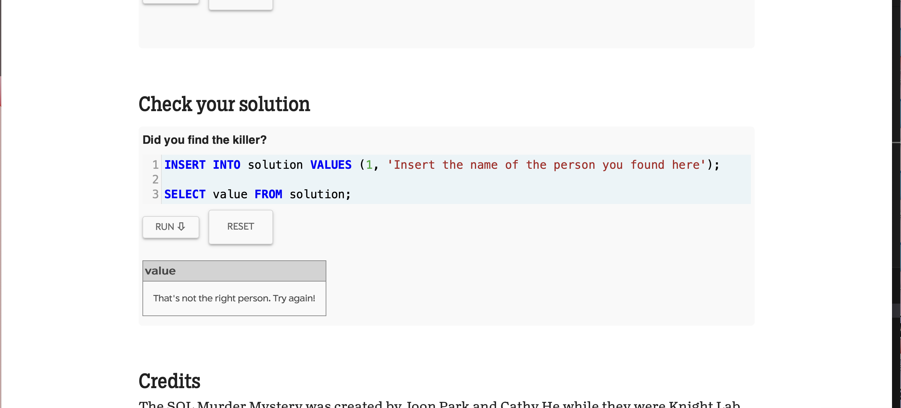
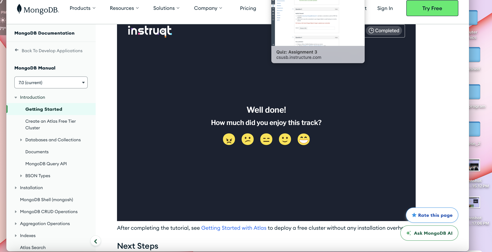
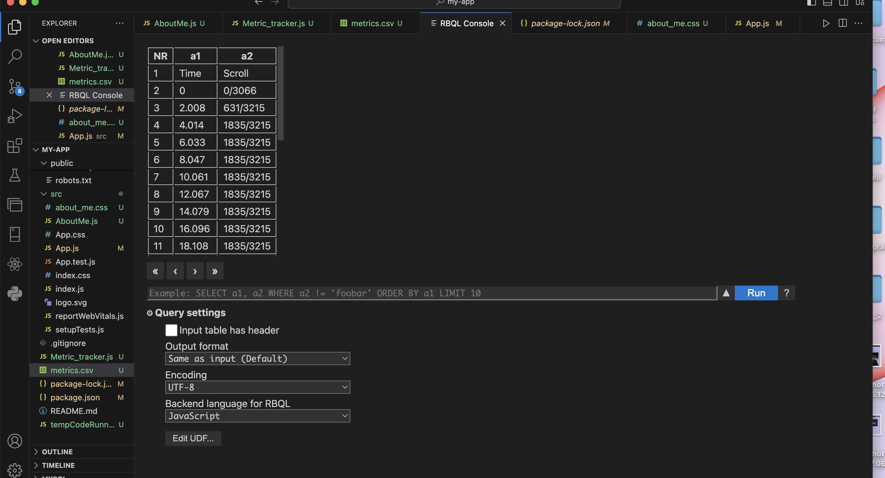

# Metric Tracker with Database
In this assignment, we are incorporating a database into our app. So, to show that we are learning/ applying, I took screenshots of the mysql mystery game. How i downloaded
MySQL on my computer. MySQL was having a difficult time getting the data from the csv file, however i was able to show the table in vscode. 
Time spent: **5** hours spent in total
## Features
The following **required** features are completed:
- [x] Organize Github projects for Assignment 3 (2 pts)
- [x] Complete SQL Mystery Walkthrough and take a screenshot or print to PDF the
webpage (2 pts)
- [x] Complete Interactive MongoDB Tutorial and take a screenshot or print to PDF
the webpage (2 pts)
- [x] Choose a SQL or NoSQL Database and set up a server (4 pts)
- [-] Modify your metric_tracker file so that the metrics are saved onto a database // having a lil trouble connecting 
(5 pts)
The following **bonus** features are implemented:
- [-] Retrieve values from the database (1 pt).
- [-] Create separate Tables (SQL) or Documents (NoSQL) for each metric and relate
them via user (2 pt).

## Screenshot and/or Video Walkthrough

