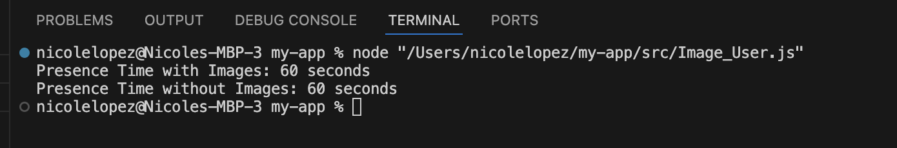
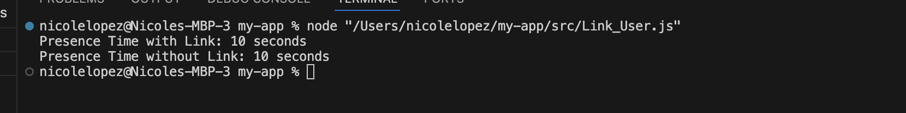
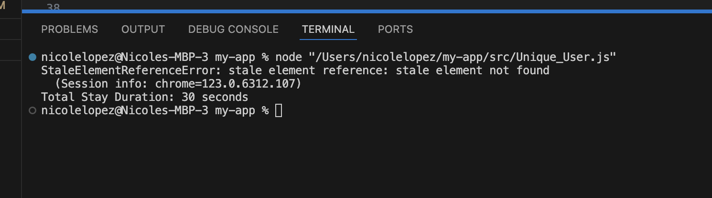
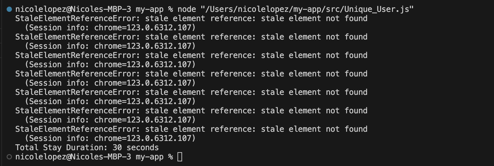

# Generate Users
Thisassignment I will track what a user does, automate how they interact based on elements on my webpage. I will be using Selenium to do checks on my website. 
Time spent: **NUMBER_HOURS_SPENT** hours spent in total
## Features
The following **required** features are completed:
- [x] Organize Github folders (2 pts)
- [x] Create a user with affinity towards keyword(s) and verify that it works (3
pts)
- [x] Create a user with affinity towards image(s) and verify that it works (3 pts)
- [x] Create a user with affinity towards links and verify that it works (3 pts)
- [x] Describe a user with unique affinities (1 pt)
- [x] Create a user with unique affinities and verify that it works (3 pts)
The following **bonus** features are implemented:
- [ ] Create a unique user with an affinity OUTSIDE of keywords, images, or links
(1.5 pt)
- [ ] Uploaded files for a unique user BOTH in javascript and python (1.5 pt)
- [ ] DESCRIBE ANY OTHER FEATURES HERE.
## Screenshot and/or Video Walkthrough

